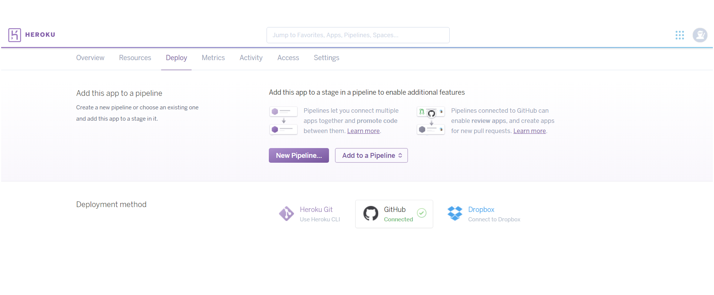
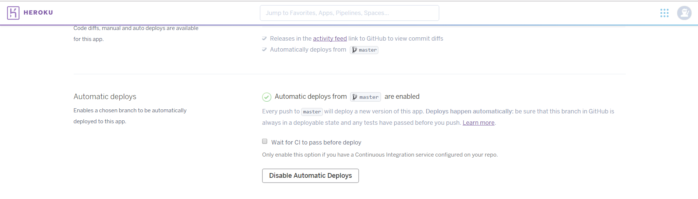

# SUSI Google Hangout Bot

## Setup:

- To set up bot for Google hangouts you will need a gmail account first. If you don&#39;t have a gmail account then [create](https://accounts.google.com/SignUp?hl=en-GB) one as we will need it to set up bot.

- Clone this repository and then we will deploy repository to heroku.

- To deploy your bot to heroku you need an account on [Heroku](https://www.heroku.com/) and after making an account make an app.

- Deploy app using github deployment method.

- Select Automatic deployment method.

- Go to settings of your app and select config variables and paste your password for bot to this and name it as password. 

- Your SUSI Google Hangouts bot is read. 
